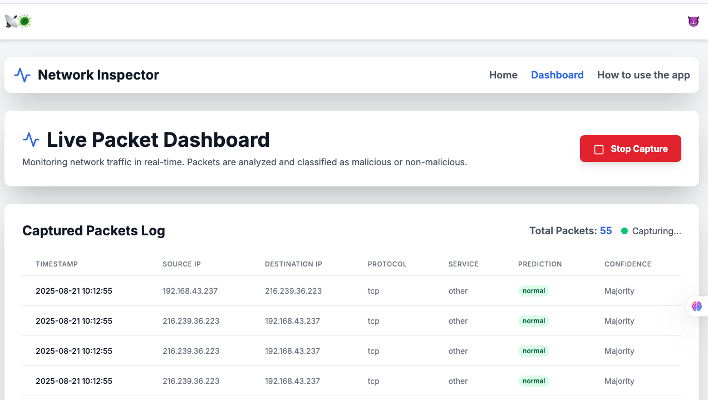

# 🛡️ AI-Powered Live Intrusion Detection System (IDS) using Majority Votes


An **AI-driven Intrusion Detection System (IDS)** that monitors live network traffic and detects potential cyber-attacks in real time.  
This system leverages multiple machine learning classifiers and applies a **majority voting mechanism** to improve detection accuracy and reduce false alarms.  

---

## 🚀 Features

- 🔍 **Live Network Packet Capture** (Scapy/Socket)  
- 🤖 **Multiple Machine Learning Models** (Naïve Bayes, Decision Tree, KNN, etc.)  
- 🗳️ **Majority Voting Ensemble** for robust classification  
- 📊 **Interactive Web Interface** powered by Flask  
- 📂 Upload network traffic files (e.g., PCAP) for offline analysis  
- 🖥️ Visualization of detection results in the browser  
- ⚡ Lightweight, fast, and easy to deploy  

---

## 🏗️ Project Structure

```bash
AI-Powered-Live-Intrusion-Detection-System-using-Majority-Votes/
│
├── app.py                 # Flask application entry point
├── requirements.txt       # Python dependencies
│
├── templates/             # HTML templates (Flask Jinja2)
│   ├── base.html
│   ├── index.html
│   ├── live_capture.html
│   ├── results.html
│   └── howto.html
│
├── models/                # Saved ML models (PKL files)
│   ├── BNB_Classifier.pkl
│   ├── DTC_Classifier.pkl
│   ├── KNN_Classifier.pkl
│   ├── Features.pkl
│   ├── StandardScaler.pkl
│   └── LabelEncoder_class.pkl
│
└── uploads/               # Uploaded files (PCAP, PDF, DOCX, etc.)


---

## ⚙️ Installation

1. **Clone this repository**
   ```bash
   git clone https://github.com/nasare34/AI-Powered-Live-Intrusion-Detection-System-using-Majority-Votes.git
   cd AI-Powered-Live-Intrusion-Detection-System-using-Majority-Votes

---

## ⚙️ Installation

1. **Clone this repository**
   ```bash
   git clone https://github.com/nasare34/AI-Powered-Live-Intrusion-Detection-System-using-Majority-Votes.git
   cd AI-Powered-Live-Intrusion-Detection-System-using-Majority-Votes

2. **Create a virtual environment (recommended)**
python3 -m venv network_detector_env
source network_detector_env/bin/activate   # On macOS/Linux
network_detector_env\Scripts\activate      # On Windows

3. **Install dependencies**

pip install -r requirements.txt

4.**Run the application**
python app.py

5.**Open in browser**
http://127.0.0.1:5000


# 🖼️ Screenshots  

### 🔹 Home Page  


### 🔹 Live Capture & Detection  


---

# 📊 Models & Methodology  

### Classifiers Used:
- **Bernoulli Naïve Bayes**  
- **Decision Tree Classifier**  
- **K-Nearest Neighbors (KNN)**  
- **Ensemble Method: Majority Voting**  

### Preprocessing:
- Feature Scaling  
- Label Encoding  

✅ The **ensemble ensures more robust predictions** by combining the strengths of individual models.  

---

# 🔒 Security Notice  

⚠️ This project is for **research and educational purposes only.**  
It is not intended as a **production-grade intrusion detection system.**  
Please test it in a **safe, controlled network environment.**  

---

# 🤝 Contributing  

Contributions are welcome! 🎉  
If you’d like to improve the project:  

1. **Fork the repo**  
2. **Create a new branch** (`feature-new`)  
3. **Commit your changes**  
4. **Push and submit a PR**  

---

# 📜 License  

MIT License © 2025 **Bright Ofori and Akwasi Asare**  


